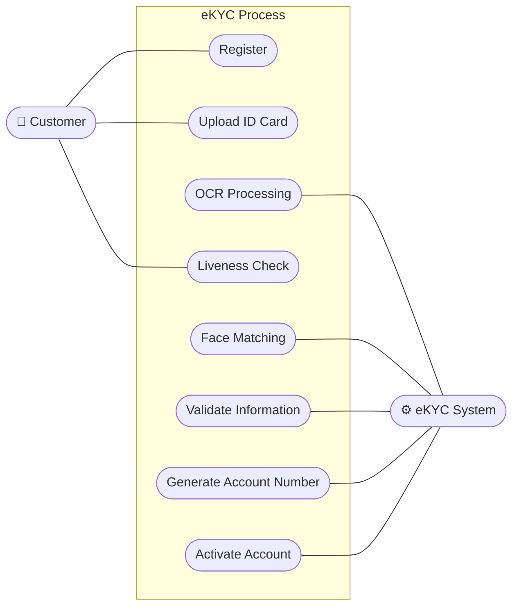

# Software Requirements Specification (SRS) - eKYC System

**Mục lục (Table of Contents)**
1. [Introduction](#1-introduction)
   1.1 [Purpose](#11-purpose)
   1.2 [Scope](#12-scope)
   1.3 [Definitions](#13-definitions)
   1.4 [Acronyms](#14-acronyms)
   1.5 [References](#15-references)
2. [Overall Description](#2-overall-description)
   2.1 [Product Perspective](#21-product-perspective)
   2.2 [Product Functions](#22-product-functions)
   2.3 [User Classes and Characteristics](#23-user-classes-and-characteristics)
   2.4 [Operating Environment](#24-operating-environment)
   2.5 [Design Constraints](#25-design-constraints)
   2.6 [Assumptions and Dependencies](#26-assumptions-and-dependencies)
3. [Specific Functional Requirements](#3-specific-functional-requirements)
   3.1 [Module 1: Đăng ký tài khoản](#31-module-1-đăng-ký-tài-khoản)
   3.2 [Module 2: Upload CCCD](#32-module-2-upload-cccd)
   3.3 [Module 3: OCR đọc dữ liệu CCCD](#33-module-3-ocr-đọc-dữ-liệu-cccd)
   3.4 [Module 4: Liveness Check](#34-module-4-liveness-check)
   3.5 [Module 5: Face Matching](#35-module-5-face-matching)
   3.6 [Module 6: Đối chiếu dữ liệu](#36-module-6-đối-chiếu-dữ-liệu)
   3.7 [Module 7: Kích hoạt tài khoản](#37-module-7-kích-hoạt-tài-khoản)
4. [Non-Functional Requirements](#4-non-functional-requirements)
   4.1 [Security](#41-security)
   4.2 [Performance](#42-performance)
   4.3 [Availability](#43-availability)
   4.4 [Reliability](#44-reliability)
   4.5 [Scalability](#45-scalability)
   4.6 [Maintainability](#46-maintainability)
   4.7 [Logging](#47-logging)
   4.8 [Audit](#48-audit)
   4.9 [Backup & Recovery](#49-backup-recovery)
   4.10 [Compliance](#410-compliance)
5. [Visual Diagram](#5-visual-diagram)

***

## 1. Introduction

### 1.1 Purpose
Tài liệu Đặc tả Yêu cầu Phần mềm (Software Requirements Specification - SRS) này được biên soạn nhằm cung cấp một mô tả toàn diện, chi tiết và chuẩn hóa về tính năng Định danh Khách hàng Điện tử (eKYC) trên nền tảng ngân hàng số của ABC Bank. 

Mục đích chính của tài liệu là định hướng và làm cơ sở tham chiếu thống nhất cho Đội ngũ phát triển (Development Team), Đội ngũ kiểm thử (QA/QC), cũng như các bên liên quan (Stakeholders). Tài liệu này đảm bảo mọi cá nhân tham gia dự án đều nắm vững các yêu cầu chức năng, phi chức năng, và quy trình nghiệp vụ cần được triển khai để quá trình Handover diễn ra suôn sẻ và sản phẩm cuối cùng đáp ứng đúng kỳ vọng của Ban Giám đốc ABC Bank.

### 1.2 Scope
Hệ thống eKYC được thiết kế nhằm mục tiêu số hóa và tự động hóa toàn bộ quy trình định danh và mở tài khoản trực tuyến cho khách hàng cá nhân mới của ABC Bank. Phạm vi cốt lõi của tính năng này tập trung vào các phân hệ chính bao gồm:
*   **Đăng ký tài khoản:** Thu thập thông tin cơ bản (Số điện thoại, Email) và xác thực người dùng ban đầu qua OTP.
*   **Upload & Đọc CCCD (OCR):** Tự động thu thập hình ảnh Căn cước công dân và trích xuất các trường thông tin văn bản bằng công nghệ Nhận dạng ký tự quang học.
*   **Xác thực khuôn mặt (Liveness Check & Face Matching):** Đánh giá thực thể sống để chống giả mạo và đối chiếu khuôn mặt khách hàng với ảnh trên giấy tờ tùy thân.
*   **Kích hoạt tài khoản:** Kiểm tra chéo dữ liệu với cơ sở dữ liệu nội bộ/bên thứ ba (nếu có), xử lý logic rủi ro và tự động khởi tạo, kích hoạt tài khoản ngay lập tức cho khách hàng.

*Phạm vi loại trừ:* Tài liệu này không bao gồm các yêu cầu về tích hợp mở thẻ tín dụng, cấp hạn mức thấu chi hoặc các sản phẩm vay vốn, vốn sẽ thuộc các giai đoạn (phase) phát triển sau.

### 1.3 Definitions
*   **eKYC (Electronic Know Your Customer):** Là giải pháp định danh khách hàng điện tử, cho phép ngân hàng xác thực danh tính của người dùng thông qua môi trường Internet mà không yêu cầu khách hàng phải đến quầy giao dịch trực tiếp.
*   **Liveness Check (Kiểm tra thực thể sống):** Công nghệ sử dụng AI để xác minh người đang thao tác trước camera là người thật tại thời điểm thực, nhằm ngăn chặn các hành vi gian lận như sử dụng hình ảnh, video phát lại hoặc mặt nạ silicon.
*   **Face Matching (So khớp khuôn mặt):** Quá trình phân tích và so sánh các đặc trưng sinh trắc học giữa ảnh chân dung chụp trực tiếp (selfie) và ảnh được trích xuất từ tài liệu định danh (CCCD) để tính toán tỷ lệ trùng khớp.
*   **Zero Manual Operation:** Định hướng thiết kế luồng nghiệp vụ trong đó hệ thống tự động đưa ra các quyết định phê duyệt (Approve) hoặc từ chối (Reject) dựa trên Business Rules, loại bỏ hoàn toàn (hoặc tối thiểu hóa tối đa) sự can thiệp thủ công từ nhân viên Back-office.

### 1.4 Acronyms
*   **ABC Bank:** Tên định danh của ngân hàng chủ quản.
*   **API:** Application Programming Interface (Giao diện lập trình ứng dụng).
*   **CCCD:** Căn cước công dân.
*   **OCR:** Optical Character Recognition (Nhận dạng ký tự quang học).
*   **OTP:** One-Time Password (Mật khẩu sử dụng một lần).
*   **NFC:** Near-Field Communication (Giao tiếp trường gần).
*   **QA/QC:** Quality Assurance / Quality Control (Đảm bảo/Kiểm soát chất lượng phần mềm).
*   **SRS:** Software Requirements Specification (Đặc tả yêu cầu phần mềm).
*   **UML:** Unified Modeling Language (Ngôn ngữ mô hình hóa thống nhất).

### 1.5 References
1.  Tài liệu Phân tích Nghiệp vụ (Business Analysis Document) - Dự án eKYC ABC Bank (Kết quả Bài 01).
2.  Tiêu chuẩn quốc tế IEEE 830-1998 và IEEE 29148-2011 về Hướng dẫn viết Đặc tả yêu cầu phần mềm.
3.  Thông tư số 16/2020/TT-NHNN của Ngân hàng Nhà nước Việt Nam hướng dẫn mở và sử dụng tài khoản thanh toán tại tổ chức cung ứng dịch vụ thanh toán.
4.  Tài liệu tích hợp kỹ thuật (API Documentation) từ nhà cung cấp giải pháp Core AI.

***

## 2. Overall Description

### 2.1 Product Perspective
Tính năng eKYC không phải là một hệ thống hoạt động độc lập (stand-alone) mà là một phân hệ (module) cốt lõi được tích hợp trực tiếp vào ứng dụng Mobile Banking hiện hữu của ABC Bank. Phân hệ này đóng vai trò là "cánh cổng" đầu tiên tiếp đón khách hàng mới. 

Về mặt kiến trúc, hệ thống eKYC tương tác với các hệ thống xung quanh bao gồm:
*   **Mobile App (Client-side):** Giao diện tương tác trực tiếp với khách hàng (chụp ảnh, quét khuôn mặt, nhập thông tin).
*   **Core Banking System:** Tiếp nhận dữ liệu đã được xác thực từ eKYC để khởi tạo User ID, số tài khoản thanh toán và thông tin khách hàng (CIF).
*   **Third-party AI Engine (Vendor):** Hệ thống của đối tác cung cấp dịch vụ phân tích hình ảnh AI để thực hiện bóc tách dữ liệu (OCR) và so khớp khuôn mặt (Face Matching/Liveness Check).
*   **Notification Gateway:** Hệ thống gửi SMS/Email OTP và thông báo trạng thái tài khoản.

### 2.2 Product Functions
Hệ thống cung cấp một luồng trải nghiệm liền mạch với các nhóm chức năng chính như sau:
1.  **Xác thực thông tin liên lạc:** Đăng ký và xác minh Số điện thoại/Email thông qua mã OTP.
2.  **Thu thập dữ liệu giấy tờ (OCR):** Cho phép người dùng chụp ảnh mặt trước và mặt sau của CCCD. Tự động trích xuất các trường thông tin dạng text.
3.  **Xác thực sinh trắc học:** Quay video ngắn hoặc chụp ảnh selfie theo chỉ dẫn của hệ thống (nháy mắt, quay trái/phải, mỉm cười) để chứng minh thực thể sống. So sánh khuôn mặt với ảnh trên CCCD.
4.  **Kiểm tra chéo và Đánh giá rủi ro (Risk Check):** Tự động đối chiếu thông tin với danh sách đen (Blacklist/Watchlist) của ngân hàng và cơ sở dữ liệu quốc gia (nếu có).
5.  **Cấp phát tài khoản tự động:** Khởi tạo tài khoản, kích hoạt dịch vụ Mobile Banking và thông báo kết quả cho khách hàng ngay lập tức.

### 2.3 User Classes and Characteristics
Hệ thống phục vụ 2 nhóm người dùng chính:
*   **End-User (Khách hàng cá nhân mới):**
    *   *Đặc điểm:* Là người dùng đại chúng, không đòi hỏi kiến thức chuyên môn về công nghệ. Họ kỳ vọng quá trình đăng ký diễn ra nhanh chóng, ít thao tác nhập liệu bằng tay và giao diện trực quan.
    *   *Môi trường thao tác:* Thường thao tác trên điện thoại cá nhân ở các điều kiện ánh sáng và kết nối mạng khác nhau.
*   **System Admin / Back-office Team (Nhân sự nội bộ ABC Bank):**
    *   *Đặc điểm:* Đội ngũ vận hành hệ thống. Dù mục tiêu là "Zero Manual Operation", nhóm này vẫn cần quyền truy cập vào CMS / Admin Portal để theo dõi các trường hợp bị từ chối do rủi ro, cấu hình các tham số hệ thống.

### 2.4 Operating Environment
*   **Client-side (Mobile App):**
    *   Hệ điều hành iOS phiên bản 12.0 trở lên.
    *   Hệ điều hành Android phiên bản 8.0 trở lên.
    *   Yêu cầu thiết bị có camera hoạt động (độ phân giải tối thiểu 720p).
*   **Server-side (Backend):**
    *   Hệ thống Backend được triển khai trên hạ tầng điện toán đám mây (Cloud) hoặc On-Premise của ABC Bank.
    *   Hệ điều hành Server: Linux (CentOS/Ubuntu).
    *   Hệ quản trị cơ sở dữ liệu: Oracle SQL / PostgreSQL.

### 2.5 Design Constraints
*   **Ràng buộc pháp lý (Regulatory Constraints):** Phải tuân thủ tuyệt đối Thông tư 16/2020/TT-NHNN về eKYC. Dữ liệu cá nhân, thông tin sinh trắc học của khách hàng không được phép lưu trữ tại máy chủ nước ngoài (Data Localization) và phải tuân thủ Luật Bảo vệ dữ liệu cá nhân (Nghị định 13/2023/NĐ-CP).
*   **Ràng buộc kỹ thuật (Technical Constraints):** Thời gian phản hồi của các API AI (OCR và Face Matching) không được vượt quá 3 giây/request.
*   **Ràng buộc bảo mật (Security Constraints):** Toàn bộ dữ liệu truyền tải từ Mobile App đến Server phải được mã hóa đầu cuối bằng chuẩn TLS 1.2 trở lên. Dữ liệu hình ảnh phải được xóa ngay lập tức khỏi thiết bị sau khi gửi lên server.

### 2.6 Assumptions and Dependencies
*   **Giả định (Assumptions):** Khách hàng sử dụng CCCD còn hiệu lực pháp lý, không bị mờ nhòe, rách nát đến mức không thể nhận diện. Khách hàng thực hiện eKYC trong môi trường có đủ ánh sáng và kết nối mạng ổn định.
*   **Sự phụ thuộc (Dependencies):** Quá trình eKYC phụ thuộc hoàn toàn vào độ ổn định của (1) Hệ thống Core Banking của ABC Bank và (2) API của Vendor cung cấp giải pháp AI. Hệ thống SMS Gateway của nhà mạng cũng phải hoạt động ổn định.

***

## 3. Specific Functional Requirements

### 3.1 Module 1: Đăng ký tài khoản
*   **Mục tiêu:** Thu thập số điện thoại/email của khách hàng và xác minh quyền sở hữu thông qua mã OTP, tạo Session định danh ban đầu.
*   **Actors:** End-User, Hệ thống eKYC, Notification Gateway.
*   **Preconditions:** Khách hàng đã tải ứng dụng Mobile Banking, chưa có tài khoản tại ABC Bank.
*   **Main Flow:**
    1.  Khách hàng nhập số điện thoại và email cá nhân.
    2.  Hệ thống kiểm tra định dạng và gọi API sinh mã OTP.
    3.  Notification Gateway gửi SMS OTP đến số điện thoại.
    4.  Khách hàng nhập mã OTP.
    5.  Hệ thống xác thực mã OTP hợp lệ và khởi tạo Session eKYC.
*   **Alternative Flow:** Khách hàng không nhận được SMS, nhấn "Gửi lại OTP". Hệ thống sinh mã mới và gửi lại.
*   **Exception Flow:**
    *   Số điện thoại đã được đăng ký -> Hệ thống báo lỗi.
    *   Nhập sai OTP quá 5 lần -> Tạm khóa số điện thoại trong 15 phút.
    *   OTP hết hạn -> Yêu cầu lấy mã mới.
*   **Postconditions:** Số điện thoại được đánh dấu là "Verified" và gắn với Session mở tài khoản.
*   **Business Rules:** Mỗi số điện thoại chỉ được liên kết với một Khách hàng (CIF) duy nhất.
*   **Validation Rules:** Số điện thoại phải đúng định dạng di động Việt Nam. Mã OTP gồm 6 chữ số.

### 3.2 Module 2: Upload CCCD
*   **Mục tiêu:** Thu thập hình ảnh rõ nét mặt trước và mặt sau của thẻ CCCD.
*   **Actors:** End-User, Hệ thống eKYC.
*   **Preconditions:** Đã hoàn thành Module 1.
*   **Main Flow:**
    1.  Hệ thống mở camera với khung viền hướng dẫn.
    2.  Khách hàng đưa mặt trước CCCD vào khung, hệ thống tự động bắt nét và chụp ảnh.
    3.  Lặp lại cho mặt sau CCCD.
    4.  Hệ thống hiển thị ảnh để khách hàng xác nhận lại.
*   **Alternative Flow:** Khách hàng chủ động nhấn nút "Chụp lại" nếu thấy mờ.
*   **Exception Flow:** 
    *   Khách hàng từ chối cấp quyền camera -> Dừng quy trình.
    *   Môi trường quá tối -> Hệ thống cảnh báo.
*   **Postconditions:** Ảnh hai mặt CCCD được mã hóa và sẵn sàng gửi lên Server.
*   **Business Rules:** Bắt buộc sử dụng Live-Camera. Hệ thống vô hiệu hóa tính năng tải ảnh từ Thư viện (Gallery).
*   **Validation Rules:** Hình ảnh định dạng JPG/PNG, dung lượng 500KB - 5MB. Không bị khuyết góc.

### 3.3 Module 3: OCR đọc dữ liệu CCCD
*   **Mục tiêu:** Trích xuất tự động các thông tin văn bản từ hình ảnh CCCD.
*   **Actors:** Hệ thống eKYC, AI Engine (OCR Vendor).
*   **Preconditions:** Đã chụp thành công CCCD.
*   **Main Flow:**
    1.  Hệ thống gửi luồng ảnh lên AI Engine.
    2.  AI phát hiện giả mạo giấy tờ.
    3.  AI bóc tách thông tin (Số CCCD, Họ tên, Ngày sinh,...) trả về định dạng JSON.
    4.  Hiển thị dữ liệu lên màn hình để khách hàng kiểm tra.
*   **Alternative Flow:** Khách hàng được phép chỉnh sửa lại trường "Địa chỉ thường trú" bằng tay nếu OCR nhận sai dấu câu.
*   **Exception Flow:**
    *   AI phát hiện giấy tờ giả -> Từ chối lập tức.
    *   Độ chính xác dưới ngưỡng -> Yêu cầu chụp lại.
    *   Timeout kết nối Vendor.
*   **Postconditions:** Thông tin định danh được số hóa thành công.
*   **Business Rules:** KHÔNG cho phép chỉnh sửa: Số CCCD, Họ tên, Ngày sinh, Giới tính.
*   **Validation Rules:** Số CCCD phải đúng 12 ký tự số. Tuổi >= 18.

### 3.4 Module 4: Liveness Check
*   **Mục tiêu:** Đảm bảo người thao tác là người thật, loại trừ rủi ro giả mạo.
*   **Actors:** End-User, AI Engine.
*   **Preconditions:** Đã hoàn thành OCR.
*   **Main Flow:**
    1.  Hệ thống yêu cầu khách hàng đưa khuôn mặt vào khung.
    2.  Phát ra chỉ dẫn ngẫu nhiên ("Mỉm cười", "Chớp mắt").
    3.  Ghi lại video và đẩy lên AI Engine.
    4.  Kết quả trả về là "Live".
*   **Alternative Flow:** Áp dụng Active 3D Liveness (Đọc chuỗi số trên màn hình).
*   **Exception Flow:**
    *   Phát hiện gian lận (Spoofing) -> Từ chối quy trình.
    *   Quá thời gian quy định -> Yêu cầu thử lại.
*   **Postconditions:** Xác thực là người thật. Trích xuất ảnh selfie chân dung.
*   **Business Rules:** Thất bại Liveness 3 lần -> Khóa chức năng mở tài khoản trong 24 giờ.
*   **Validation Rules:** Liveness Score >= 95%.

### 3.5 Module 5: Face Matching
*   **Mục tiêu:** Đối chiếu ảnh chân dung thực tế với ảnh trên CCCD.
*   **Actors:** Hệ thống eKYC, AI Engine.
*   **Preconditions:** Đã trích xuất ảnh CCCD và ảnh selfie.
*   **Main Flow:**
    1.  Gửi đồng thời 2 ảnh cho AI Engine.
    2.  AI tính toán điểm số tương đồng (Matching Score).
*   **Alternative Flow:** N/A.
*   **Exception Flow:** Hai khuôn mặt không khớp -> Hệ thống từ chối mở tài khoản.
*   **Postconditions:** Ghi nhận khách hàng chính là chủ nhân giấy tờ.
*   **Business Rules:** Zero Manual Operation: Score >= 85% Approve tự động, < 85% Reject tự động.
*   **Validation Rules:** `isMatch = true` và `score >= 85.0`.

### 3.6 Module 6: Đối chiếu dữ liệu
*   **Mục tiêu:** Kiểm tra tuân thủ AML và Blacklist.
*   **Actors:** Hệ thống eKYC, Core Banking, Hệ thống AML.
*   **Preconditions:** Đã pass Face Matching.
*   **Main Flow:**
    1.  Gửi dữ liệu lên Core Banking và AML.
    2.  Quét Blacklist/Watchlist/CIC.
    3.  Xác nhận khách hàng chưa có mã CIF.
*   **Alternative Flow:** Khách hàng từng mở tài khoản nhưng đã hủy -> Re-onboarding.
*   **Exception Flow:**
    *   Nằm trong Blacklist -> Đóng băng quy trình.
    *   Số CCCD đã có tài khoản Active -> Yêu cầu dùng "Quên mật khẩu".
*   **Postconditions:** Đánh dấu "Đủ điều kiện pháp lý và rủi ro".
*   **Business Rules:** Tuân thủ AML/CFT của NHNN.
*   **Validation Rules:** Thời gian xử lý <= 2 giây/hồ sơ.

### 3.7 Module 7: Kích hoạt tài khoản
*   **Mục tiêu:** Khởi tạo tài khoản thanh toán và cấp thông tin đăng nhập.
*   **Actors:** End-User, Hệ thống eKYC, Core Banking, Notification Gateway.
*   **Preconditions:** Pass Risk Check.
*   **Main Flow:**
    1.  Khách hàng thiết lập Username và Password.
    2.  Gửi lệnh tạo CIF, CASA lên Core Banking.
    3.  Core Banking trả về số tài khoản.
    4.  Kích hoạt App.
    5.  Gửi SMS/Email chào mừng.
*   **Alternative Flow:** Username đã tồn tại -> Ứng dụng gợi ý đổi tên khác.
*   **Exception Flow:** Core Banking timeout -> Lưu hồ sơ Pending, batch job sẽ retry sau.
*   **Postconditions:** Tài khoản Active.
*   **Business Rules:** Tài khoản eKYC có giới hạn giao dịch theo Thông tư 16.
*   **Validation Rules:** Tên đăng nhập >= 6 ký tự. Mật khẩu phải mạnh.

***

## 4. Non-Functional Requirements

### 4.1 Security
*   **Encryption:** In-transit TLS 1.2+; At-rest AES-256 cho PII.
*   **Authentication:** OAuth 2.0 / JWT cho API; OTP 6 số (120s) cho Session.
*   **Authorization:** RBAC (Role-Based Access Control). Không được xem chéo Session.
*   **Data Privacy:** Tuân thủ Nghị định 13/2023/NĐ-CP. KHÔNG lưu dữ liệu ảnh trên thiết bị (No Local Storage).
*   **Audit Log:** Mọi event truy cập trái phép được ghi lại vào SIEM và không thể thay đổi (Immutable log).

### 4.2 Performance
*   **Response Time:** API Vendor (OCR, Liveness) < 3s; API Core Banking < 2s; Toàn bộ quy trình eKYC < 3 phút.
*   **Concurrent Users:** Chịu tải tối thiểu 5.000 CCU trong giờ cao điểm.
*   **API Timeout:** Client Timeout là 15 giây; Vendor Timeout là 10 giây (Auto fallback).

### 4.3 Availability
*   Uptime tối thiểu 99.99%.
*   Active-Active Data Center (Zero-downtime failover).

### 4.4 Reliability
*   Zero Data Loss trong trường hợp hỏng hóc vật lý.
*   Có cơ chế Retry và Compensation Transaction cho API khởi tạo tài khoản.

### 4.5 Scalability
*   Kiến trúc Microservices triển khai trên Kubernetes.
*   Tự động Scale-out khi CPU > 75% và Scale-in khi lưu lượng giảm.

### 4.6 Maintainability
*   Tự động hóa CI/CD.
*   Sử dụng Blue/Green Deployment hoặc Canary Release.

### 4.7 Logging
*   Centralized Logging với ELK Stack.
*   Yêu cầu Data Masking/Redacting đối với dữ liệu nhạy cảm.

### 4.8 Audit
*   Lưu trữ Metadata phiên eKYC vĩnh viễn (IP, Device, Vendor billing API).
*   Phục vụ đối soát với Vendor AI và báo cáo NHNN.

### 4.9 Backup & Recovery
*   Full backup hàng ngày, Incremental backup mỗi giờ (Off-site storage).
*   RTO (Recovery Time Objective) < 1 giờ; RPO (Recovery Point Objective) < 15 phút.

### 4.10 Compliance
*   Thông tư 16/2020/TT-NHNN về eKYC.
*   Luật An ninh mạng (Data Localization).

***

## 5. Visual Diagram

Sơ đồ luồng thao tác người dùng và hệ thống eKYC (Use Case Diagram):

*Mã Mermaid gốc đính kèm:*

